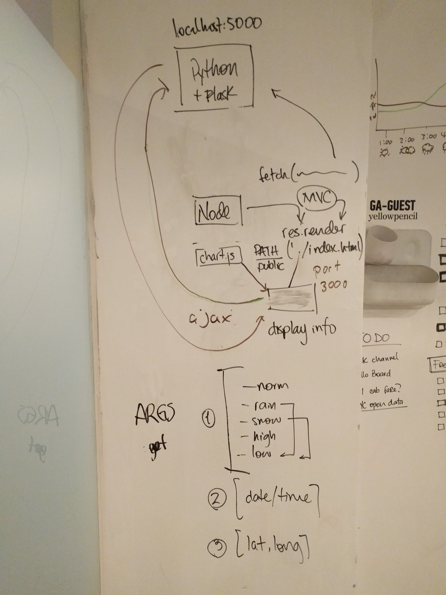
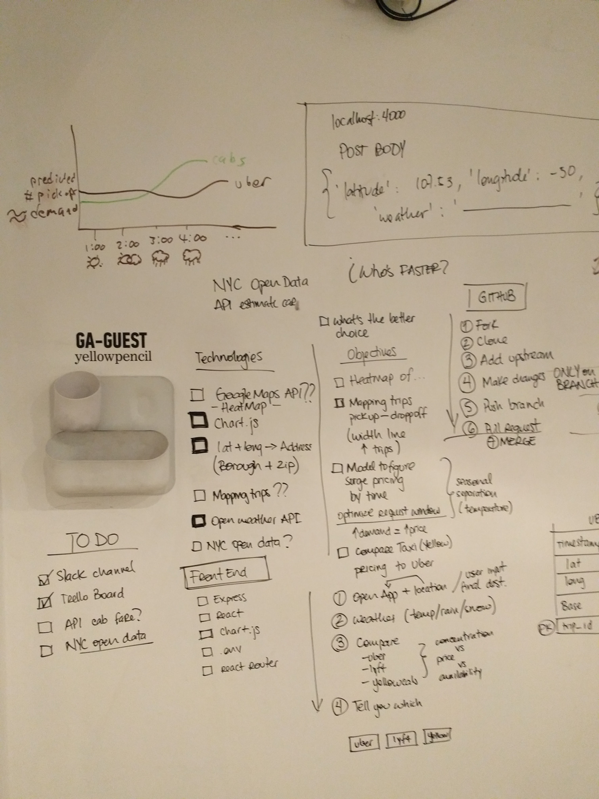

# Who's Faster

### Our Amazing team
###### DSI
- Amer Shalan
- Max Federman

###### WDI
- Mike Cohen
- Natty Davis
- Synclair Wang
- Jonathan Ahrens

### User Story
This application will ask the user to provide information on his location (either picked up by browser or taken in by address) and will make a cross-reference between older data related with a model that will determine the best response time of a service and choose which one will the best option related with the weather conditions.

### Wireframes

### Technologies
- [ ] Python
- [ ] Node.js
- [ ] Express.js
- [ ] Fetch

